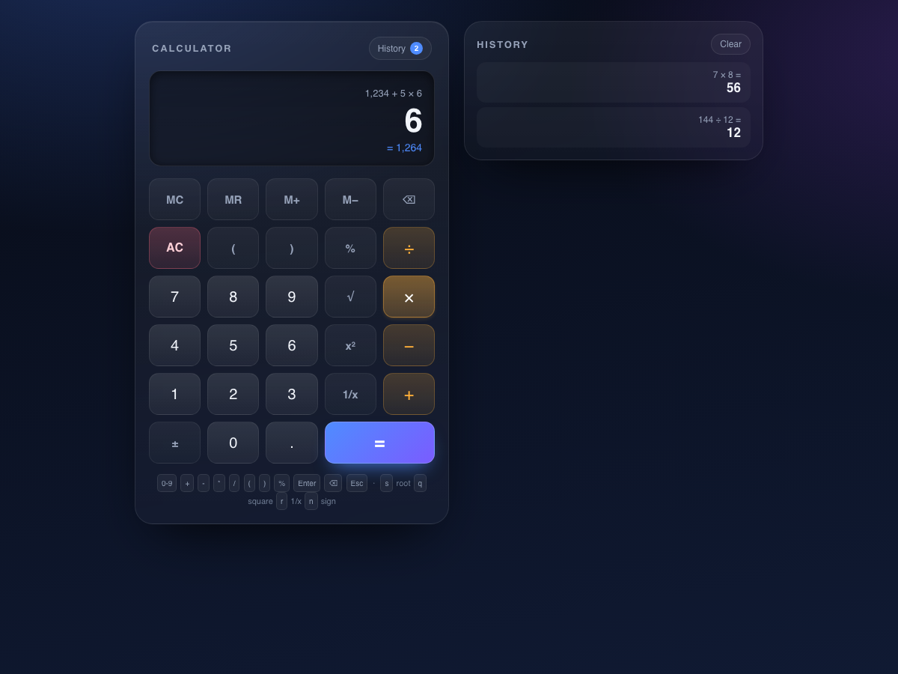

# Calculator

A working calculator: a dependency-free, no-build web app with a pure arithmetic
engine, a full keypad UI, keyboard support, memory keys and a persisted history.



## Technology choice

Vanilla JavaScript + HTML + CSS. No framework, no bundler, no npm dependencies.

Why: a calculator is mostly *correctness* — precedence, unary minus, percent
semantics, floating-point display. Those are exactly the parts that are easy to
get subtly wrong and easy to test, so the code is split into two layers:

| Layer | File | Depends on | Tested by |
| --- | --- | --- | --- |
| Engine: lexer → parser → evaluator → formatter → input state machine | `calc-engine.js` | nothing (no DOM, no `eval`) | `test-engine.js` (Node, 198 checks) |
| UI: DOM, CSS, keyboard, history panel | `index.html`, `styles.css`, `app.js` | the engine | `selftest.js` (real Chromium, 69 checks) |

That split means the arithmetic is verified deterministically in Node, and the
UI is verified by actually clicking real buttons in a real browser.

## Run it

```bash
cd task-12-calculator
npm start                 # http://127.0.0.1:8080
PORT=3000 npm start       # any port
```

Or just open `index.html` directly in a browser — it works from `file://` too.

## Test it

```bash
npm test                  # engine unit tests + browser E2E + screenshot
npm run test:engine       # engine unit tests only
```

`npm test` does three things and exits non-zero on any failure:

1. **`test-engine.js`** — 198 assertions under Node. Precedence, associativity,
   unary handling, implicit multiplication, percent semantics, rounding and
   formatting, every error path, the full keypad state machine (typing,
   backspace, ±, memory, history, equals-chaining, error recovery), and a
   deterministic fuzz check of 500 random expressions against a reference
   evaluator.
2. **`selftest.html` + `selftest.js`** — 69 assertions in headless Chromium. It
   loads the real app in an iframe, clicks the real buttons, dispatches real
   keyboard events, checks the grid layout and computed styles, reloads the page
   to verify persistence, and fails on any console error or uncaught exception.
3. **`shot.html`** — writes `screenshot.png` from the live app.

`CHROME_BIN=/path/to/chrome npm test` overrides browser discovery.

## Features

- **Correct precedence** — `2 + 3 × 4 = 14`, not `20`. Parentheses, `^` (right
  associative), and left-associative `× ÷` / `+ -`.
- **Live expression line** — shows the whole entry, e.g. `1,234 + 5 × 6`.
- **Running total preview** — `= 1,264` appears under the display before you
  press `=`.
- **Armed operator highlight** — the waiting operator key stays lit so you can
  see which operation is pending.
- **Percent that behaves** — `50 + 10% = 55`, `200 × 10% = 20`.
- **Unary operators** — `√`, `x²`, `1/x` act on the operand you can see, `±`
  toggles its sign, and each works on a finished result too.
- **Memory** — `MC MR M+ M-` with an `M` badge; memory survives reload.
- **History** — every completed calculation, newest first, click any entry to
  reuse its value; persisted in `localStorage`; capped at 60 entries.
- **Full keyboard support** with a visible hint line.
- **No float noise** — `0.1 + 0.2` shows `0.3`; results are rounded to 12
  significant digits, with thousands separators and automatic font shrinking
  for long numbers.
- **Errors are states, not crashes** — divide by zero, `√(-1)`, malformed input
  and overflow each produce a readable message; typing anything next starts
  fresh. `calculate()` never throws.

## Semantics worth knowing

| Expression | Result | Why |
| --- | --- | --- |
| `2 + 3 × 4` | `14` | standard precedence |
| `-2^2` | `4` | unary binds tighter than `^` (calculator convention, like Windows Calculator) |
| `2^3^2` | `512` | `^` is right associative |
| `50 + 10%` | `55` | `a ± b%` is relative to `a` |
| `200 × 10%` | `20` | `a × b%` is absolute |
| `100 + (10%)` | `100.1` | an explicit group is absolute |
| `1 + =` | `1` | a dangling operator is dropped rather than erroring |
| `( 1 + 2 =` | `3` | unclosed groups auto-close on `=` |
| `2(3+4)` | `14` | implicit multiplication |
| `1.2.3` | *Malformed number* | rejected, not silently parsed |
| `9^9^9` | *Result is too large* | overflow reported, not `Infinity` |

Keyboard: `0-9 . + - * / ( ) %`, `Enter`/`=`, `Backspace`, `Esc`/`Delete`,
`s` = √, `q` = x², `r` = 1/x, `n` = ±.

## Files

```
index.html       markup + keypad (data-key attributes are the test hooks)
styles.css       dark glassy theme, 5-column grid, responsive
calc-engine.js   lexer, recursive-descent parser, evaluator, formatter, CalcSession
app.js           DOM wiring, keyboard handling, history rendering, persistence
serve.js         zero-dependency static server (npm start)
test-engine.js   198 engine assertions (incl. 500-expression fuzz)
selftest.html    browser test page (loads index.html in a visible iframe)
selftest.js      drives the real DOM, reports JSON for run-tests.js
shot.html        screenshot harness
run-tests.js     orchestrates all of the above
```

## Issues found while testing (and fixed)

The bugs below were all found by the tests in this repo, not by guesswork:

1. **`±` showed the wrong number.** Pressing `5 ±` displayed `5` while the
   expression read `-5`; the display only looked at the number literal and
   ignored the unary minus in front of it. Fixed by making the display
   sign-aware. (caught by a view-model assertion)
2. **`√` ignored the sign of the operand.** `9 ± √` computed `-√9 = -3` instead
   of rejecting `√(-9)`. Fixed by giving functions the signed operand while `±`
   keeps the unsigned one. (caught by a session test)
3. **`x²` on a negative operand was `-(5²)`.** Fixed by grouping signed
   operands, so `(-5)² = 25`. (caught by a session test)
4. **`x²` rendered as `^ 2` in the expression line** and left the display
   showing the exponent. Replaced with a real superscript postfix token, so the
   line reads `2 + 5²` and the display shows the operand `25` with `= 27` as the
   running total. (caught by inspecting the view model)
5. **Memory keys did not commit the entry.** `10 M+ 5 M-` produced memory
   `-95`, because typing `5` appended to the still-open `10` (making `105`).
   Now `M+`/`M-` commit the value and the next digit starts a new number.
   (caught by a memory test)
6. **The operator highlight vanished too early.** It cleared as soon as you
   typed the right-hand operand. Now it tracks the last binary operator still
   awaiting an operand.
7. **The E2E harness raced over HTTP.** `iframe.contentDocument.readyState`
   reports `complete` for the initial `about:blank` document, so the suite
   occasionally tested a blank frame when the page was served over `http://`
   instead of `file://`. The harness now polls for the app globals. (caught by
   running the suite against the served app)
8. **Bidi risk in the expression line.** `direction: rtl` (used to keep the tail
   of a long expression visible) can reorder digits and operators; replaced with
   explicit scroll-to-end.

Three further failures were wrong *test* expectations rather than app bugs
(operator replacement `1 + × 2 = 2`, the key count 29 not 25, and a leading `/`
being ignored); the tests were corrected to document the intended behaviour.

## Known limitations

- Single-argument functions only (`√`), no trig/logarithms.
- 15-digit input cap and 12-significant-digit results, so it is a pocket
  calculator, not an arbitrary-precision one.
- History and memory live in `localStorage`; they are per-browser, not synced.
