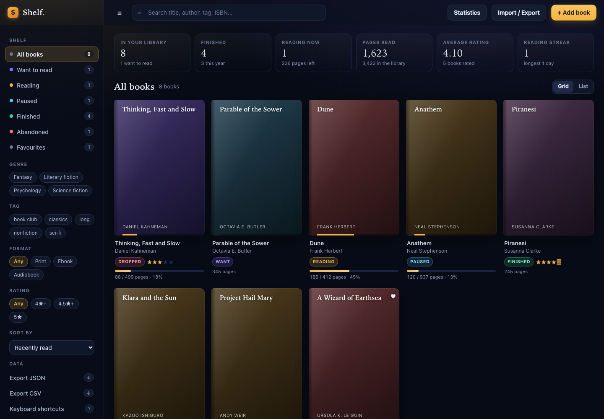

# Shelf — a book tracker

A working app for keeping track of the books in your life: what you are reading,
how far in you are, what you thought of it, what is next, and how your reading
year is going.



## Technology choice

Vanilla JavaScript + HTML + CSS. No framework, no bundler, no npm dependencies,
no build step. Open `index.html` and it runs.

Why: a tracker is mostly *bookkeeping correctness* — a reading-status state
machine, half-star ratings, ISBN checksums, date coherence, duplicate detection,
statistics that add up. Those are exactly the parts that are easy to get subtly
wrong and easy to test, so the code is split into two layers:

| Layer | File | Depends on | Tested by |
| --- | --- | --- | --- |
| Engine: records, validation, ISBN, status machine, search, stats, import/export | `book-engine.js` | nothing (no DOM, no storage) | `test-engine.js` — Node, 3,861 assertions |
| UI: DOM, CSS, dialogs, keyboard, persistence | `index.html`, `styles.css`, `app.js` | the engine | `selftest.js` — real Chromium, 244 checks |

Every engine function is deterministic: anything that depends on the clock takes
a `now` argument, so the tests pin the date and never flake. The UI layer is
verified by actually clicking real buttons in a real browser, then reloading the
page to prove persistence.

## Run it

```bash
cd task-15-book-tracker
npm start                 # http://127.0.0.1:8080
PORT=3000 npm start       # any port
```

Or just open `index.html` directly — it works from `file://` too, with no server
and no network access.

## Test it

```bash
npm test                  # engine unit tests + browser E2E + screenshot
npm run test:engine       # engine unit tests only
```

`npm test` does three things and exits non-zero on any failure:

1. **`test-engine.js`** — 3,861 assertions under Node across 30 suites: text and
   number coercion, date keys (including leap years and impossible dates like
   `2024-02-30`), ISBN-10/ISBN-13 checksums and spreadsheet-notation recovery,
   record normalization and idempotence, every validation error path, the full
   reading-status state machine, progress maths and pace projection, search /
   filter / sort (including a fuzz pass over 20 libraries × 10 sort keys), stats
   and streaks, duplicate detection and three merge modes, JSON round-trip with
   schema migration, CSV escaping, and a Goodreads-style CSV importer.
2. **`selftest.html` + `selftest.js`** — 244 assertions in headless Chromium
   across 12 suites. It loads the real app in an iframe and drives it like a
   user: typing in the search box, clicking shelf filters, filling in and
   submitting the add/edit form (including the half-star click target), using
   the detail dialog's progress controls, deleting and undoing, pressing every
   keyboard shortcut, importing JSON and CSV, reloading the page to verify
   persistence, and checking that corrupt storage degrades instead of crashing.
   It fails on any console error or uncaught exception.
3. **`shot.html`** — writes `screenshot.png` from the live app.

`CHROME_BIN=/path/to/chrome npm test` overrides browser discovery. Headless
Chrome on macOS does not always exit on its own, so `run-tests.js` watches its
output and shuts it down as soon as the work is done — the whole suite runs in a
few seconds.

## What it does

**Track the reading, not just the book**
- Five-shelf status machine — *want to read → reading → finished*, with *paused*
  and *abandoned* — that keeps dates and progress coherent on every move.
  Finishing a book fills in the finish date, jumps to the last page and logs it;
  re-opening a finished book clears the date and rewinds to page 0.
- Page-level progress with a progress bar, plus a per-book progress log so
  "pages read" means something. Recording progress on a book on the *want* shelf
  starts it; reaching the last page finishes it; dropping back below it re-opens
  it. Progress past the end clamps instead of corrupting the record.
- Reading pace (pages/day) and a projected finish date, derived from the log.
- Half-star ratings, favourites, tags, format (print/ebook/audiobook), genre and
  free-form notes.

**Find things**
- Instant search across title, author, genre, tags, ISBN and notes; multiple
  terms are ANDed (`dune herbert`).
- Shelf, genre, tag, format, rating and favourites filters that compose, with a
  live count that tells you what you are looking at.
- Ten sort orders (recently added, title, author, rating, length, progress,
  recently finished/started/read, status) with sensible per-key defaults.
- Grid and list views.

**See the shape of your reading**
- Stat strip: library size, finished this year, pages left in what you are
  reading, pages read, average rating, current streak.
- Statistics dialog: books finished per month for the last 12 months, genre
  breakdown, the full half-star rating distribution, most-read authors,
  completion rate, average length, longest and shortest book, days with reading
  logged, and best streak.

**Get your data in and out**
- **JSON export/import** — the complete, re-importable backup, including progress
  history, versioned and migrated on the way in. Older v1 payloads (`shelf`,
  `pages`, `review`, `dateRead`, …) are upgraded automatically.
- **CSV export** — RFC-4180 quoting, opens in any spreadsheet.
- **Goodreads-style CSV import** — recognises the usual headers (`Title`,
  `Author`, `ISBN13`, `My Rating`, `Number of Pages`, `Exclusive Shelf`,
  `Date Read`, `Bookshelves`, `My Review`), maps shelves onto the five statuses,
  prefers ISBN-13, splits `sci-fi|classics` shelves into tags, and skips
  title-less rows with a report.
- Importing never silently duplicates: matching is by ISBN when both records
  have one and by normalized title+author otherwise, and you choose whether
  duplicates are **skipped**, **merged** (fill in blanks, keep the furthest-along
  status, never lose progress) or **replaced**.

**Small things that matter**
- Deleting is undoable — the toast keeps the book (and its position) for a few
  seconds.
- Live duplicate warning as you type a title you already own.
- ISBN is checksum-verified as you leave the field, and stored normalized but
  displayed hyphenated.
- Your library is stored in `localStorage` under `book-tracker.v1`; nothing is
  ever sent anywhere. Corrupt or partial storage is reported rather than
  crashing, and an explicitly empty library is a valid state.
- Accessible: labelled controls, `aria-pressed` on toggles, `aria-current` on
  the active shelf, focus management in dialogs, arrow-key navigation across
  the grid, and `prefers-reduced-motion` support.

## Keyboard shortcuts

| Key | Action |
| --- | --- |
| <kbd>/</kbd> | Focus the search box |
| <kbd>n</kbd> | Add a book |
| <kbd>s</kbd> | Statistics |
| <kbd>v</kbd> | Toggle grid / list |
| <kbd>f</kbd> | Show only favourites |
| <kbd>1</kbd>–<kbd>5</kbd> | Filter by shelf |
| <kbd>0</kbd> | Show every book |
| <kbd>Esc</kbd> | Close a dialog, or clear the search |
| <kbd>?</kbd> | Shortcut list |

## Data model

```js
{
  id: "b_lx8k2m3f7q",     // stable, generated
  title: "Dune",
  author: "Frank Herbert",
  isbn: "9780441013593",  // digits only, checksum-valid
  genre: "Science fiction",
  tags: ["classics", "sci-fi"],
  format: "print",        // print | ebook | audiobook
  pageCount: 412,
  currentPage: 186,
  status: "reading",      // want | reading | paused | finished | abandoned
  rating: 4.5,            // 0 = unrated, otherwise 0.5–5
  favorite: false,
  notes: "",
  addedAt: "2026-07-30",  // local calendar dates, YYYY-MM-DD
  startedAt: "2026-08-30",
  finishedAt: "",
  updatedAt: "2026-09-08",
  progressLog: [{ date: "2026-09-07", page: 186 }]
}
```

Dates are plain local calendar strings rather than timestamps, so "finished
today" means what you think it means regardless of timezone.

## Project layout

```
task-15-book-tracker/
├── index.html        the app shell and dialogs
├── styles.css        design tokens and components
├── app.js            UI layer — render, events, persistence (window.BookApp)
├── book-engine.js    pure domain layer (window.BookEngine, also a Node module)
├── test-engine.js    engine unit tests + fuzz
├── selftest.html/js  browser end-to-end tests
├── run-tests.js      one command: engine + browser + screenshot
├── shot.html         screenshot harness (loads a sample library)
├── serve.js          optional static server
└── screenshot.png
```

First run starts with an empty shelf; the empty state offers a one-click sample
library of eight books if you want to look around before entering your own.
